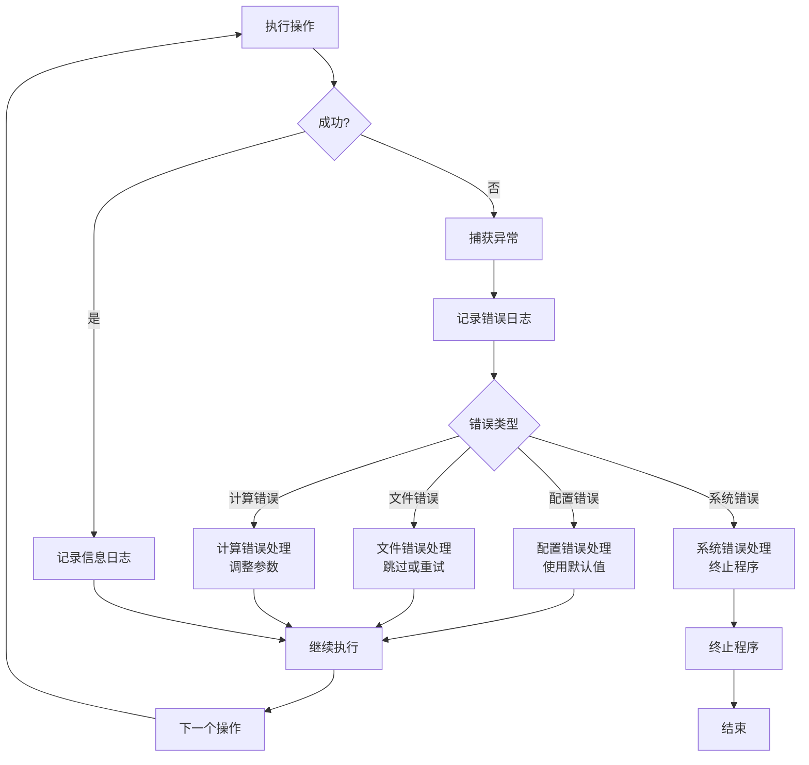

# Flood Python 调用关系图

## 整体架构图


## 核心模拟流程图

```mermaid
sequenceDiagram
    participant CLI as 命令行接口
    participant Controller as 主控制器
    participant Config as 配置管理
    participant Time as 时间管理
    participant IO as I/O管理
    participant Physics as 物理引擎
    participant Hydraulics as 水力学计算
    participant Storage as 存储计算
    participant Diagnostics as 诊断计算

    CLI->>Controller: 创建模型实例
    Controller->>Config: 加载配置文件
    Controller->>IO: 初始化I/O管理器
    Controller->>Time: 初始化时间管理器
    Controller->>Physics: 初始化物理引擎
    Controller->>Hydraulics: 初始化水力学计算器
    Controller->>Storage: 初始化存储计算器
    Controller->>Diagnostics: 初始化诊断计算器
    
    loop 时间循环
        Controller->>Time: 更新当前时间
        Controller->>IO: 读取强迫数据
        Controller->>Physics: 计算洪水阶段
        Controller->>Hydraulics: 计算出流量
        Controller->>Hydraulics: 计算入流量
        Controller->>Storage: 更新存储量
        Controller->>Diagnostics: 计算诊断变量
        Controller->>IO: 写入输出数据
        
        alt 需要重启文件
            Controller->>IO: 写入重启文件
        end
        
        alt 模拟结束
            break 退出循环
        end
    end
    
    Controller->>IO: 关闭文件
    Controller->>Diagnostics: 输出性能报告
```

## 物理过程详细调用图


## 数据流图


## 类继承和组合关系图


## Numba加速函数调用图

```mermaid
graph TB
    subgraph "Python主函数"
        PyPhysics[PhysicsEngine.calculate_flood_stage]
        PyHydraulics[HydraulicsCalculator.calculate_outflow]
        PyStorage[StorageCalculator.update_storage]
        PyDiagnostics[DiagnosticsCalculator.calculate_flow_diagnostics]
    end
    
    subgraph "Numba JIT函数"
        NumbaFloodStage[calculate_flood_stage_numba<br/>@jit parallel=True]
        NumbaOutflow[calculate_outflow_numba<br/>@jit parallel=True]
        NumbaInflow[calculate_inflow_numba<br/>@jit parallel=True]
        NumbaStorage[update_storage_numba<br/>@jit parallel=True]
        NumbaDiagnostics[calculate_flow_diagnostics_numba<br/>@jit parallel=True]
        NumbaManning[calculate_manning_flow_simple<br/>@jit]
    end
    
    PyPhysics --> NumbaFloodStage
    PyHydraulics --> NumbaOutflow
    PyHydraulics --> NumbaInflow
    NumbaOutflow --> NumbaManning
    PyStorage --> NumbaStorage
    PyDiagnostics --> NumbaDiagnostics
    
    style NumbaFloodStage fill:#e1f5fe
    style NumbaOutflow fill:#e1f5fe
    style NumbaInflow fill:#e1f5fe
    style NumbaStorage fill:#e1f5fe
    style NumbaDiagnostics fill:#e1f5fe
    style NumbaManning fill:#e1f5fe
```

## 配置管理流程图


## 错误处理和日志流程图



## 测试架构图


