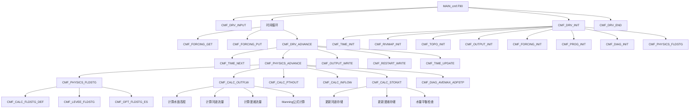
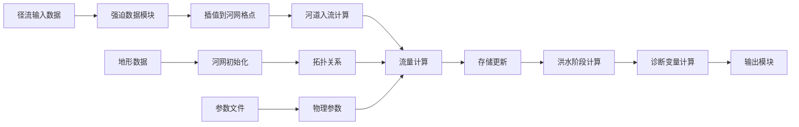

# Flood 函数调用关系图

## 主程序调用流程

## 核心模块功能分析

### 1. 主控制模块 (cmf_drv_control_mod.F90)
**位置**: `/src/cmf_drv_control_mod.F90`
**功能**: 模型初始化和终止控制
**关键函数**:
- `CMF_DRV_INPUT()` - 读取配置文件和参数
- `CMF_DRV_INIT()` - 初始化所有模块
- `CMF_DRV_END()` - 清理和终止

### 2. 时间步进模块 (cmf_drv_advance_mod.F90)
**位置**: `/src/cmf_drv_advance_mod.F90`
**功能**: 时间循环和物理过程调度
**关键函数**:
- `CMF_DRV_ADVANCE(KSTEPS)` - 主时间循环
**参数**: `KSTEPS` - 时间步数

### 3. 物理过程控制 (cmf_ctrl_physics_mod.F90)
**位置**: `/src/cmf_ctrl_physics_mod.F90`
**功能**: 物理计算过程协调
**关键函数**:
- `CMF_PHYSICS_ADVANCE()` - 物理过程主循环
- `CMF_PHYSICS_FLDSTG()` - 洪水阶段计算选择器
**参数**: 无

### 4. 流量计算模块 (cmf_calc_outflw_mod.F90)
**位置**: `/src/cmf_calc_outflw_mod.F90`
**功能**: 河道和漫滩流量计算
**关键函数**:
- `CMF_CALC_OUTFLW()` - 主流量计算
- `CMF_CALC_INFLOW()` - 入流计算
**参数**: 使用全局变量

### 5. 洪水阶段计算 (cmf_calc_fldstg_mod.F90)
**位置**: `/src/cmf_calc_fldstg_mod.F90`
**功能**: 根据存储量计算水深和洪水范围
**关键函数**:
- `CMF_CALC_FLDSTG_DEF()` - 默认洪水阶段计算
- `CMF_OPT_FLDSTG_ES()` - 向量处理器优化版本
**参数**: 使用全局存储变量

### 6. 存储更新模块 (cmf_calc_stonxt_mod.F90)
**位置**: `/src/cmf_calc_stonxt_mod.F90`
**功能**: 下一时间步存储量计算
**关键函数**:
- `CMF_CALC_STONXT()` - 存储量更新
**参数**: 使用全局流量和存储变量

### 7. 强迫数据模块 (cmf_ctrl_forcing_mod.F90)
**位置**: `/src/cmf_ctrl_forcing_mod.F90`
**功能**: 径流强迫数据处理
**关键函数**:
- `CMF_FORCING_GET(ZBUFF)` - 读取强迫数据
- `CMF_FORCING_PUT(ZBUFF)` - 插值和分配强迫数据
**参数**: `ZBUFF(NXIN,NYIN,2)` - 数据缓冲区

### 8. 输出控制模块 (cmf_ctrl_output_mod.F90)
**位置**: `/src/cmf_ctrl_output_mod.F90`
**功能**: 结果输出管理
**关键函数**:
- `CMF_OUTPUT_WRITE()` - 写入输出文件
**参数**: 使用全局输出变量

## 数据流向图

## 关键变量说明

### 全局数组变量 (定义在 yos_*.F90 文件中)
- `P2RIVSTO(NSEQMAX,1)` - 河道存储量 [m³]
- `P2FLDSTO(NSEQMAX,1)` - 漫滩存储量 [m³]
- `D2RIVOUT(NSEQMAX,1)` - 河道出流 [m³/s]
- `D2FLDOUT(NSEQMAX,1)` - 漫滩出流 [m³/s]
- `D2RIVDPH(NSEQMAX,1)` - 河道水深 [m]
- `D2FLDDPH(NSEQMAX,1)` - 漫滩水深 [m]
- `D2RIVINF(NSEQMAX,1)` - 河道入流 [m³/s]

### 地形参数
- `D2RIVELV(NSEQMAX,1)` - 河床高程 [m]
- `D2RIVWTH(NSEQMAX,1)` - 河道宽度 [m]
- `D2RIVHGT(NSEQMAX,1)` - 河道深度 [m]
- `D2RIVLEN(NSEQMAX,1)` - 河道长度 [m]
- `D2NXTDST(NSEQMAX,1)` - 到下游距离 [m]

### 物理参数
- `PMANRIV` - 河道Manning系数
- `PMANFLD` - 漫滩Manning系数
- `DT` - 时间步长 [s]
- `PGRV` - 重力加速度 [m/s²]
